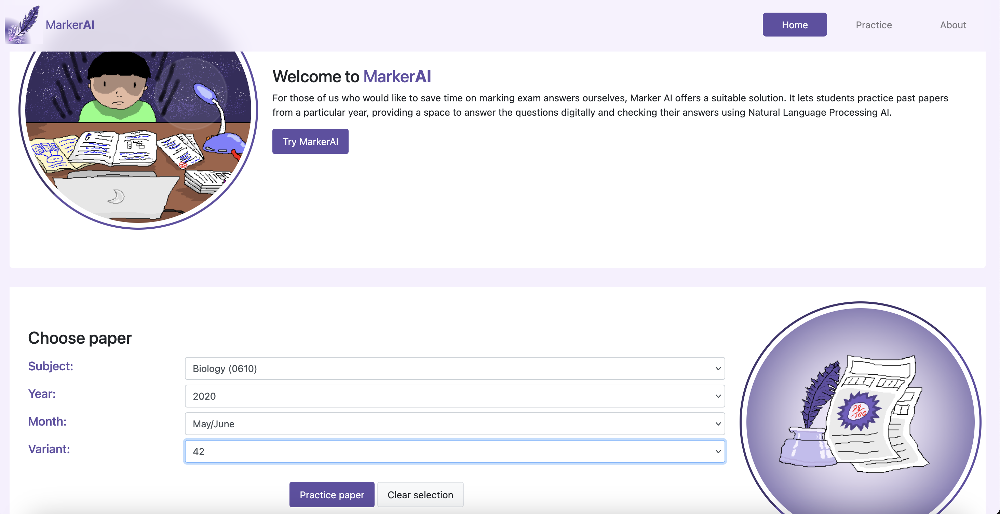
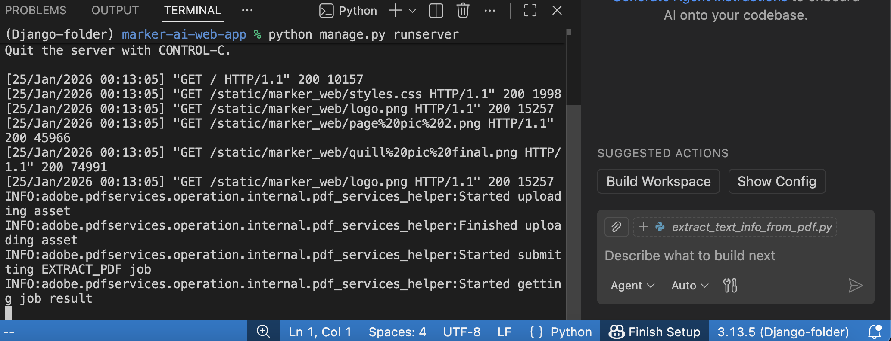
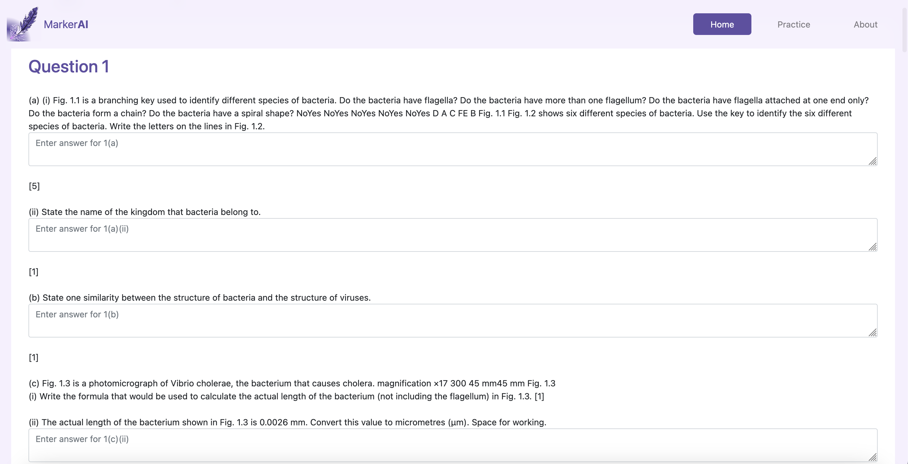
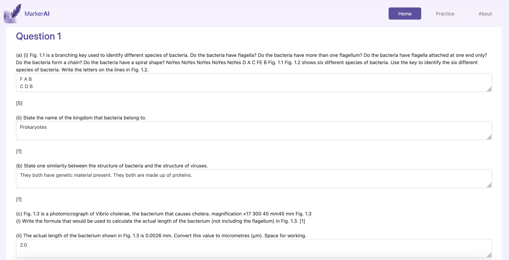
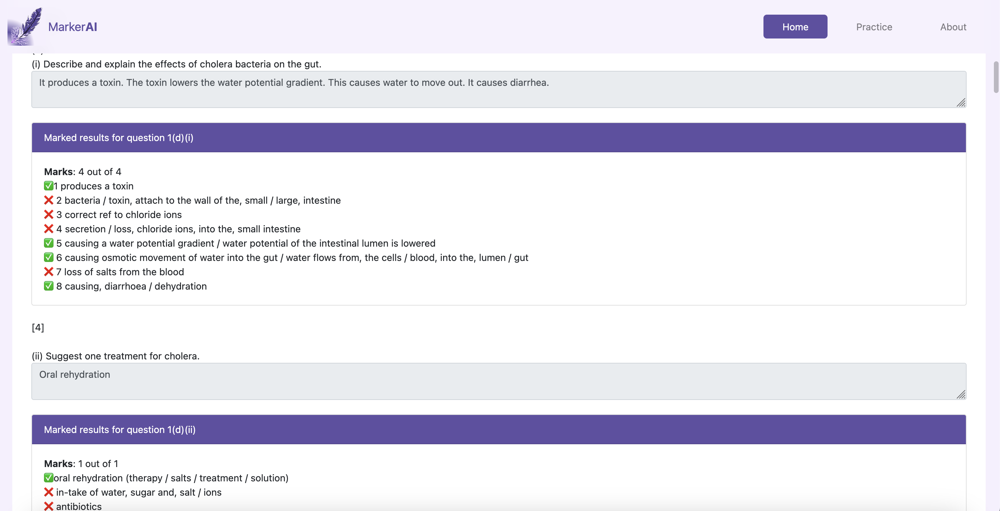

# Marker AI
Disclaimer: This is a very rudimentary passion project that I worked on when I was in Harrow International School with two of my friends. It was a way for us to explore and understand how AI and NLP technologies worked, using a context that was relatable to us - IGCSE Past Papers!

**Info on the project:** When I was in eighth grade, it was 2020 and the Covid-19 pandemic had just struck. I saw teachers struggling with online teaching, and some were using google forms... to check open ended questions word-for-word. This did not work well for any of us, and I wondered if something could be done.

This inspired me to create Marker AI, as an experimentation of how open-ended past paper exam questions could work using an AI similarity checker.

# Libraries used
- `Django` for the web app operation
- `spacy` as an intermediate package manager (used for installing en_core_web_lg)
- `tensorflow` for the AI components
- `pdfservices-sdk` for the Adobe API
- `requests` for downloading data from Best Exam Help

# How the web app works
- Marker AI uses the requests interface to download the past paper from Best Exam Help, a free past paper website.
- And then, it uses the Adobe API to extract text, table and image data from the PDF file. At the same time, I download the mark scheme file and run the same process on it too, and keep it in store.
- I then use regular expressions to clear up all the dots on the original pdf files and convert them into an HTML textarea input field. This allows for a space for answering questions
- Finally, I use Tensorflow API (Naive-Bayes and Bag of Words models) inputs to check the answer from the input texts against the mark scheme points, and see if each sentence in the student's input answer matches approximately with the points presented in the answer keys. I award points based on that.

# Current problems that still need solving
+ The regex is still not fully perfect. There are some cases where the dotted lines are not converted to input fields, meaning that question cannot be answered. 
+ Furthermore, due to inconsistencies with PDF extraction, there can be bugs happening on table-based or diagram-based questions.
+ Another issue is the inconsistency of Adobe API versions. Sometimes, there can be issues with the current code as the format of the extracted data may have changed, and thus it may need constant updates (I helped make this a little easier by storing cached versions of previously-extracted question papers, which reduces the need to call the API repeatedly)

# Screenshots of the website in operation

